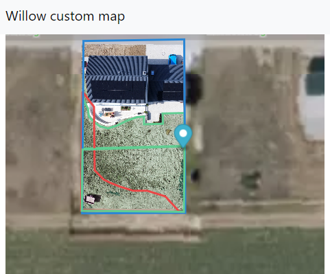

# willow-custom-map

Use your own map on your willow

## usage

1. copy the file `js/config.example.js` and rename to `config.js`
2. modify the settings in `config.js`
3. execute `start_chrome.cmd` or `start_edge.cmd`
